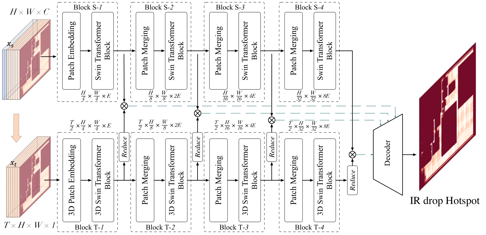

# IRNet: Fast Dynamic IR-Drop Prediction with Dual-path Spatial-Temporal Attention


## IRNet
This is the implementation of the [DATE'25 paper: Fast Dynamic IR-Drop Prediction with Dual-path Spatial-Temporal Attention](https://bunchgrape.github.io/docs/date25_irdrop_prediction.pdf)

The model architecture is as shown in the following figure. 

<div align="center">
  
</div>


## Requirements

Dependencies are listed in `requirements.txt` and can be installed by:

```sh
pip install -r requirements.txt
```

The `PyTorch` enviroment on our machine is listed. Please select the suitable PyTorch version and CUDA version to install.

## Configuration
Please refer to `utils/configs.py` to modify the configurations, where the default parameters are used in our experiments.

## Usage
Please refer to `train.py` to perform the training. The testing is included in `test.py`. We provide a pretrained model in `pretrained/model_iters_176950.pth`.

```bash
# for Training
python train.py --model_type IRNetDual

# for Testing
python test.py --model_type IRNetDual --pretrained pretrained/model_iters_176950.pth --result_dir results/test
```

## Citation
If you find our work useful in your research, please consider to cite:
```bibtex
@inproceedings{fu2025ir_predict,
    author={Fu, Bangqi and Liu, Lixin and Wang, Qijing and Wang, Yutao and Wong, Martin D. F. and Young, Evangeline F. Y.},
    booktitle={Proceedings of the 2025 IEEE/ACM Design, Automation and Test in Europe Conference},
    title={Fast Dynamic IR-Drop Prediction with Dual-path Spatial-Temporal Attention},
    year={2025},
}

```